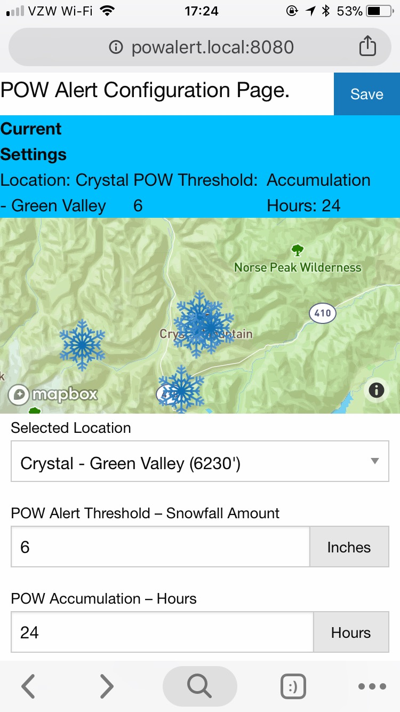
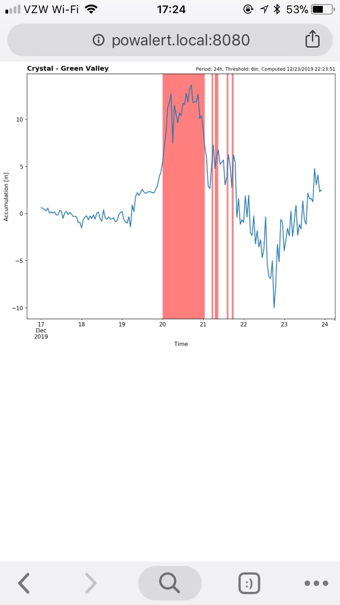
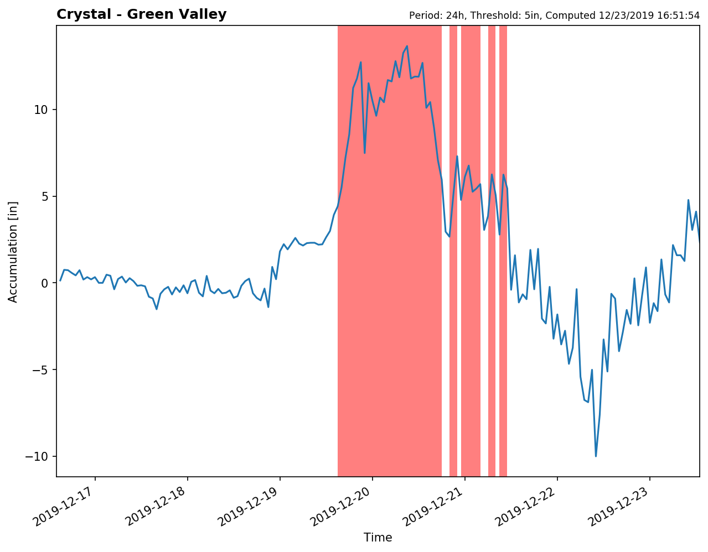

<h1>POW
</h1>
*In active development*.

Ever wanted a huge neon sign in your house to tell you when it's a powder day at your favorite resort? Yeah.

This is a small hobby project to create an in-home display to communicate
whether a specified region of interest has received a considerable amount of snowfall (**POW**) within a specified time.

It's comprised of Raspberry Pi Zero W hardware running a daemon to check for the above conditions and control a GPIO-based relay, a web server to allow for configuration on the local network, and a sqlite3 database to manage observation sites and parameters between the daemon and web server.

## Screenshots

|  |  |
|----------------------------------------------|------------------------------------------|
| Configuration                                | History Plot (Red = Detected Pow Day)    |

**Example POW Detections**

## Setup

To setup the pi, after installation (TBD):

* Run `build-nwac-stations.bash` to get NWAC stations with snow depth data into JSON.
* run `python db/config.py <db-file-name> --file stations.json` to initialize sqlite database.
* run `python server/server.py` to initialize config web server
